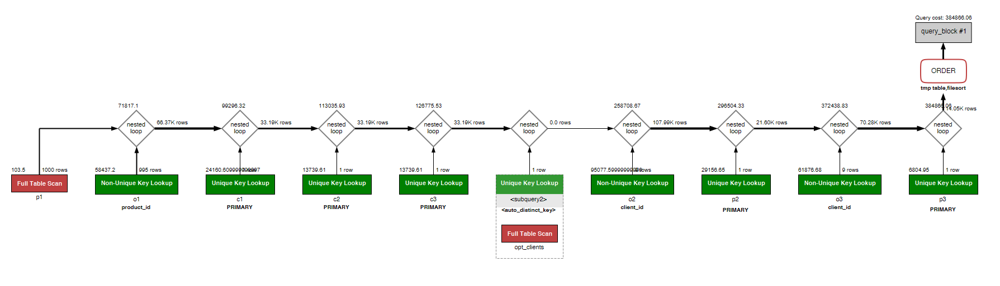
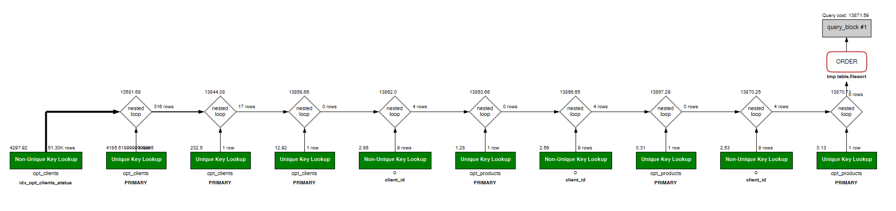

# 🚀 Practical Assignment 2: MySQL Query Optimization 🛠️

## The Mission
Hey there! 👋 Welcome to Practical Assignment 2 where we dive deep into the world of MySQL query optimization. Our goal is to take a complex, bloated query and make it sleek, fast, and efficient. Think of it as giving your database a much-needed energy drink 🥤 (but without the sugar crash).

## 🛑 **The Bad Query** 😖

This is the query that’s trying really hard, but it’s just... bad. It’s got:
- **Way too many joins** 🤯 (it’s like attending 3 Zoom meetings at the same time).
- **Inefficient filters**.
- **Zero index usage** (the query is literally wandering around your data aimlessly).
- The results? **Slow**. Really slow. Like, make-a-coffee-and-come-back slow.

**Execution Plan (Bad Query)**  

As you can see, this query involves multiple nested loops and inefficient filtering, causing a huge execution cost and time.

---

## 🎉 **The Optimized Query** 💡

Now, let me introduce you to **the hero** of the story: the **Optimized Query**. This one’s smart:
- Uses **CTEs** (Common Table Expressions) to simplify things and clean up the mess 🧼.
- **Indexes** make everything zoom like lightning ⚡.
- Returns the **same result**, but now it does it much, much faster. Seriously, you’ll be impressed. 💨

**Execution Plan (Good Query)**  

With the optimized query, the execution time is significantly reduced, and the overall performance is greatly improved.

---

## 📊 **Comparison: Bad Query vs. Optimized Query**

We didn’t just *claim* it’s faster; we’ve got the proof to back it up. We compared the results of both queries and checked if anything was missing using temporary tables and fancy SQL magic 🔮.

- **Bad Query**: Slow, heavy, and inefficient 🐢.
- **Good Query**: Fast, light, and optimized ⚡.

**Table Comparison:**
- We ensure both queries give the exact same results 🧮.
- We ran a detailed comparison using temporary tables (`bad_query_results` and `good_query_results`) to verify every column matched perfectly 🕵️.

---

## 💡 **Key Takeaways**

- **Indexes** are your best friend. Like, seriously. Don’t underestimate the power of an index 💾.
- **CTEs** not only make your queries easier to read, but they also help in breaking down complex logic, making the query planner's job easier 🧠.
- The **execution plan** is your crystal ball 🔮. It shows you where things are going wrong and where you can make them better.

---

## 🛠️ **The Files**

Here’s a quick breakdown of the files in this repo:

- **`task02.sql`**: Contains both the bad and optimized queries, and the creation of necessary indexes.
- **`comparing.sql`**: The SQL script to compare the results of the two queries.

---

Enjoy the optimizations and happy querying! 🎉

**Made with ❤️ and optimized SQL queries.**

---

This README was created with the assistance of ChatGPT! 🤖